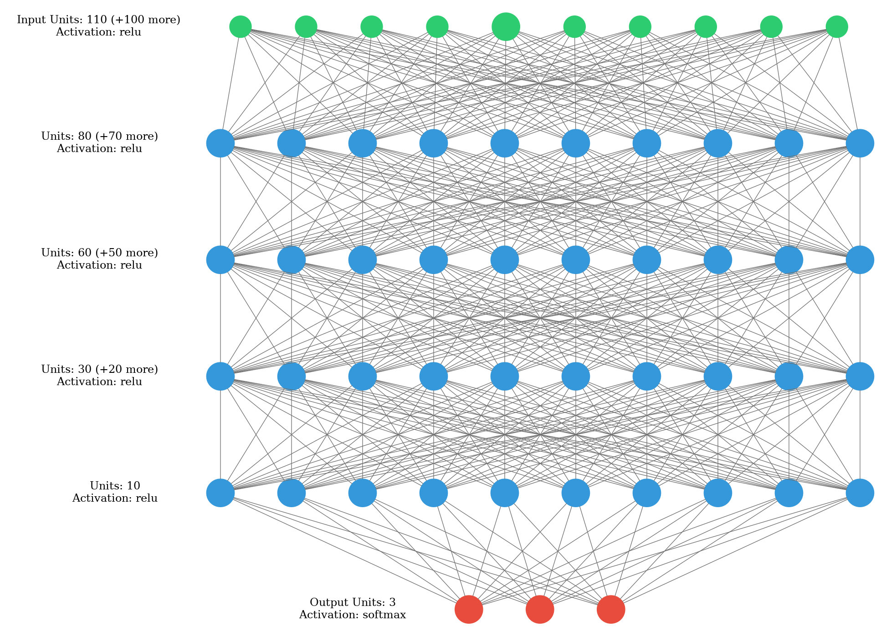
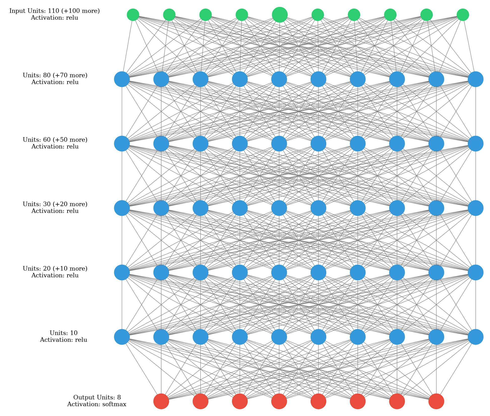
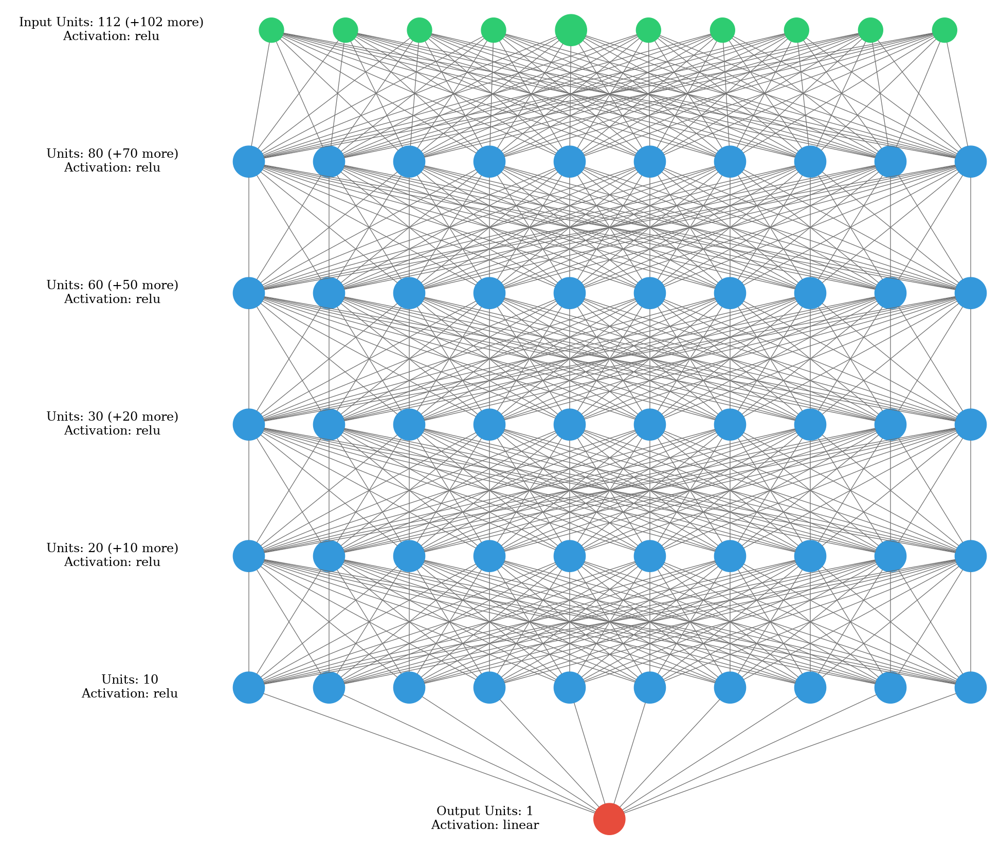

# Medication-Diagnosis
A project with my customer, performed on private data. The goal is to provide Machine Learning and Deep Learning models for the tasks of predicting Treatment and predicting Confident(success) rate.  We had an agreement on publishing this code wtihout data.

## Contents
### Machine Learning models
I used `DecisionTreeClassifier` for the task of Classification, and `SGDRegressor` for the task of Regression.
### Deep Learning models

The neural network structure I built for each tasks: there are almost 110 features, I wanted to decease 30, then 20, then 10 nodes after each layer, which resulted in the architecture below
    1. Classify Diagnosis result:
    
    2. Classify Treatment result:
    
    3. Regress Confident(success) Rate result:
    
        